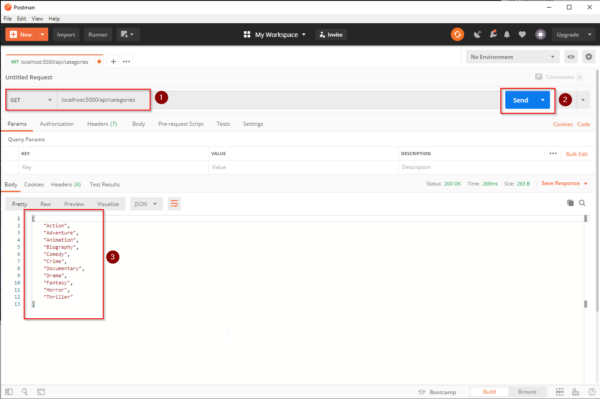

# LiveCoding - WebApi Teil 1

## Neues Projekt 


Als `Startup Project` definieren.

## Dateien in MovieManager.Web bereinigen

1. WeatherForecast.cs
2. Controllers/WeatherForecastController.cs

## UnitOfWork registrieren (IoC)

1. Dependencies nicht vergessen (Core und Persistence)!
2. ConnectionString in die appSettings.json übernehmen

### ConfigureServices (Startup.cs) anpassen

```csharp
// This method gets called by the runtime. Use this method to add services to the container.
public void ConfigureServices(IServiceCollection services)
{
  services.AddControllers();

  services.AddScoped<IUnitOfWork>((serviceProvider) => new UnitOfWork());
}
```

### UnitOfWork injizieren (CategoriesController.cs) 

```csharp
public class CategoriesController : ControllerBase
{
  private readonly IUnitOfWork _unitOfWork;

  public CategoriesController(IUnitOfWork unitOfWork)
  {
    _unitOfWork = unitOfWork;
  }
}
```


### JSON-Serializer konfigurieren (Startup.cs) 

Verhinderung von Fehlern bei zirkulären Abhängigkeiten: 

`Category` wird in Controller-Methode zurückgeliefert. `Category` enthält `Movies`, `Movies` enthalten wieder Referenzen auf `Category`.

```csharp
public class CategoriesController : ControllerBase
{
  private readonly IUnitOfWork _unitOfWork;

  public CategoriesController(IUnitOfWork unitOfWork)
  {
    _unitOfWork = unitOfWork;
  }
}
```

## Swagger einrichten (MovieManager.Web)


### Nuget-Paket Swashbuckle.AspNetCore.Swagger installieren (MovieManager.Web)


### XML-Kommentare aktivieren


### Swagger konfigurieren (Startup.cs)

```csharp
// This method gets called by the runtime. Use this method to add services to the container.
public void ConfigureServices(IServiceCollection services)
{
    // ...

    services.AddSwaggerGen(configuration =>
      {
        configuration.SwaggerDoc(
            "v1", new OpenApiInfo()
            {
              Title = "Movie Manager API",
              Version = "v1",
              Contact = new OpenApiContact()
              {
                Name = "Josef Fürlinger",
                Email = "j.fuerlinger@htl-leonding.ac.at",
                Url = new Uri("https://github.com/jfuerlinger")
              }
            });

        //Locate the XML file being generated by ASP.NET...
        var xmlFile = $"{Assembly.GetExecutingAssembly().GetName().Name}.xml";
        var xmlPath = Path.Combine(AppContext.BaseDirectory, xmlFile);

        //... and tell Swagger to use those XML comments.
        configuration.IncludeXmlComments(xmlPath);
      });
}
```

```csharp
// This method gets called by the runtime. Use this method to configure the HTTP request pipeline.
public void Configure(IApplicationBuilder app, IWebHostEnvironment env)
{
    // ...

    // Enable middleware to serve generated Swagger as a JSON endpoint
    app.UseSwagger();

    // Enable middleware to serve swagger-ui (HTML, JS, CSS, etc.)
    // specifying the Swagger JSON endpoint
    app.UseSwaggerUI(c => c.SwaggerEndpoint("swagger/v1/swagger.json", "Movie Manager API"));

    // ...
}
```


## C# Client zur Datenabfrage

1. Neue Konsolen-Applikation
2. Nuget-Pakete installieren
   1. RestSharp
   2. NewtonSoft.Json" installieren
   3. ConsoleTableExt
3. MovieManager.ConsoleApp und MovieManager.Web gleichzeitig starten
   
   


```csharp
class Program
{

private const string ServerNameWithPort = "localhost:5000";

static void Main(string[] args)
{
    RetrieveCategories();
    RetrieveMoviesForCategoryId(3);
}

private static void RetrieveMoviesForCategoryId(int id)
{
    var client = new RestClient($"https://{ServerNameWithPort}");
    var request = new RestRequest($"api/categories/{id}/movies", DataFormat.Json);

    var response = client.Get(request);

    JArray movies = JArray.Parse(response.Content);

    ConsoleTableBuilder
        .From(
            movies
                .Select(m => m.ToObject<MovieDto>())
                .OrderBy(m => m.Title)
                .ToList())
        .ExportAndWriteLine();

}

public static void RetrieveCategories()
{
    var client = new RestClient($"http://{ServerNameWithPort}");
    var request = new RestRequest("api/categories", DataFormat.Json);

    var response = client.Get(request);


    JArray categories = JArray.Parse(response.Content);

    foreach (var category in categories)
    {
    Console.WriteLine(category);
    }

    Console.ReadKey();
}

}
```

## Testen mit RestClient (Visual Studio Code)

### Vorbedingungen

1. Visual Studio Code installieren
2. Extension "RestClient" installieren

### Requests absetzen

1. Datei `xxx.http` erstellen
2. Request-Url definieren
3. "Get" klicken
4. Resultat kontrollieren


## Testen mit Postman

1. Request-Url definieren
2. "Send" klicken
3. Resultat kontrollieren



